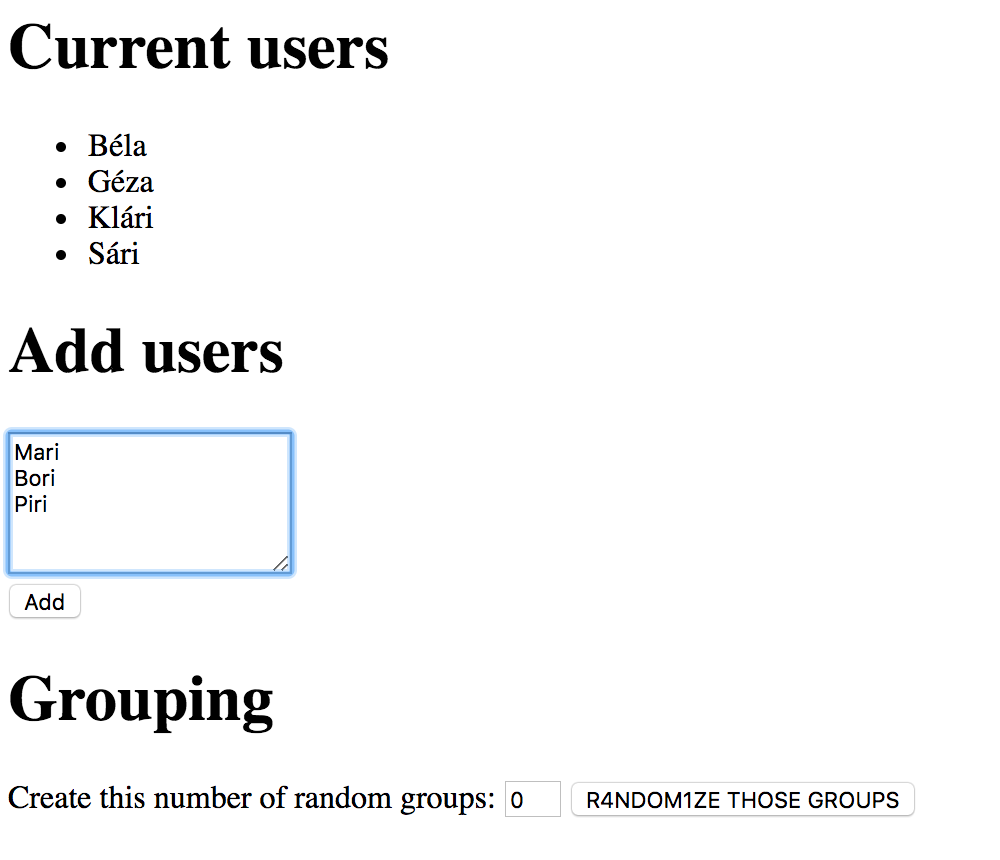
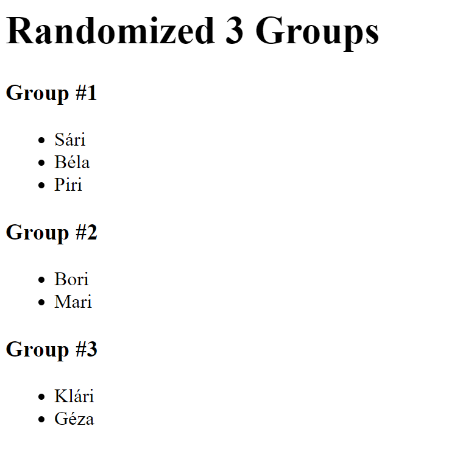

# Random Group Generator

Build a webapp that users can use to store and create random groups of people

## Highlights

- It has a frontend which can:

  - list current users
  - add multiple new users as bulk
  - sort the users into specific number of groups

## Endpoints

### GET `/`

This endpoint should render the main page:



- the **main frontend** should have 3 sections

  - current users

    - heading
    - unordered list of users

  - add users

    - heading
    - form with a textarea
    - submit button - calls POST /api/add

  - grouping

    - heading
    - input for number of groups to be created
    - submit button - calls GET /api/group

### GET `/api/list`

This endpoint should list all users saved in the database:

```json
{
    "users": [
        {
            "id": 1,
            "name": "Béla"
        },
        {
            "id": 2,
            "name": "Klári"
        },
        ...
    ]
}
```

### POST `/api/add`

This endpoint should

- split the textarea's content by the line separator
- save a new user for each line in the database
- it should send back the saved users' count as result:

```json
{
    "saved": 3
}
```

- the frontend should append the saved users to the existing unordered list

### GET `/api/group`

This endpoint should

- split randomly the existing users in the database into the specified number
  of groups coming from the form (**you don't have to store the groups in the
  database, just send them as response**):

Example query:

`http://localhost:8080/api/group?count=3`

- this should return a json with every users in 3 groups

- the users should be divided as equally into the groups as possible 
  (*e.g. for 9 user into 3 groups should be 3-3-3 users*)

```json
{
    "count": 3,
    "groups": [
        [
            {
                "id": 3,
                "name": "Sári"
            },
            {
                "id": 1,
                "name": "Béla"
            },
            {
                "id": 4,
                "name": "Piri"
            }
        ],
        [
            {
                "id": 6,
                "name": "Bori"
            },
            {
                "id": 5,
                "name": "Mari"
            }
        ],
        [
            {
                "id": 2,
                "name": "Klári"
            },
            {
                "id": 7,
                "name": "Géza"
            }
        ]
    ]
}
```

The frontend should add a new section after the existing ones with the following
content:



It should contain

- a header with the group count
- group headers with the group index and names

## Question

Given the following table named `applicants`.

| id | name               | country_id | age |
|:---|:-------------------|:-----------|:----|
| 1  | Bořivoj Souček     | 1          | 24  |
| 2  | Papp Patrícia      | 2          | 33  |
| 3  | Kocsis Ivett       | 2          | 37  |
| 4  | Slavomír Vykukal   | 1          | 20  |
| 5  | Bruno Malík        | 1          | 31  |
| 6  | Veronika Lukešová  | 1          | 18  |
| 7  | Székely Miklós     | 2          | 29  |
| 8  | Hegedüs Benjámin   | 2          | 37  |
| 9  | Nela Machová       | 1          | 20  |
| 10 | Balog Rajmund      | 2          | 39  |
| 11 | Major Borbála      | 2          | 35  |
| 12 | Evelína Horváthová | 1          | 23  |
| 13 | Vászoly Vivien     | 2          | 40  |
| 14 | Lada Stýskalová    | 1          | 27  |
| 15 | Dagmar Benešová    | 1          | 33  |

Given the following table named `countries`.

| id | country        |
|:---|:---------------|
| 1  | Czech Republic |
| 2  | Hungary        |

Write an SQL query to select the name and the country of applicants from
Hungary with the age 40.

The expected result should be the following.

| name           | country |
|:---------------|:--------|
| Vászoly Vivien | Hungary |